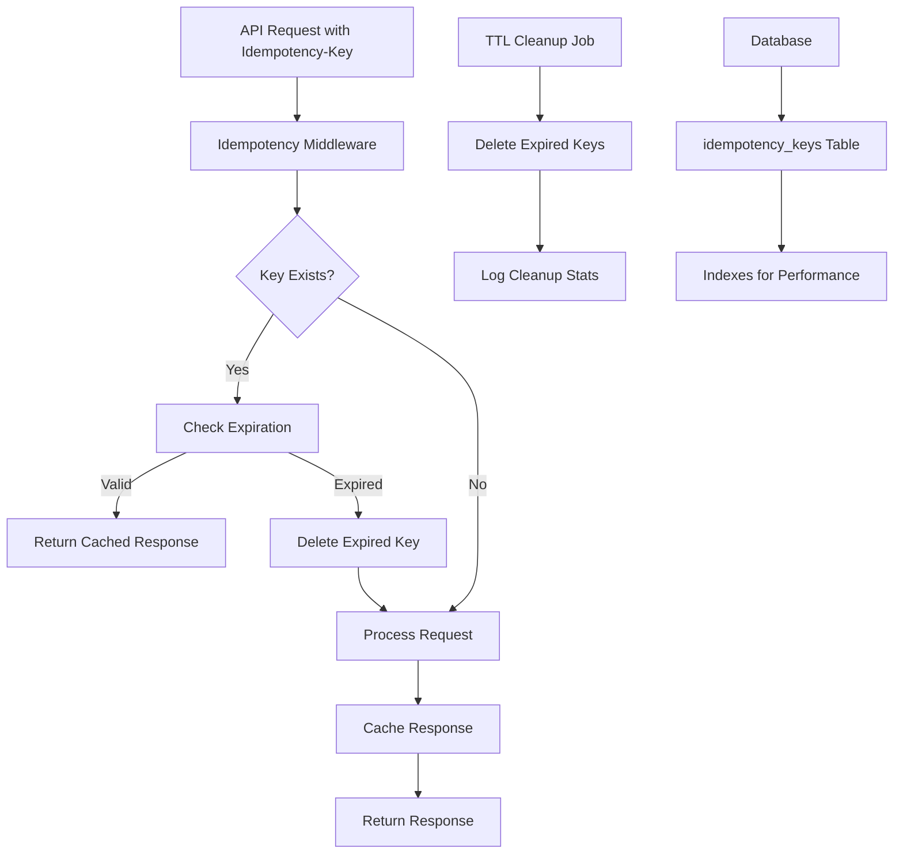
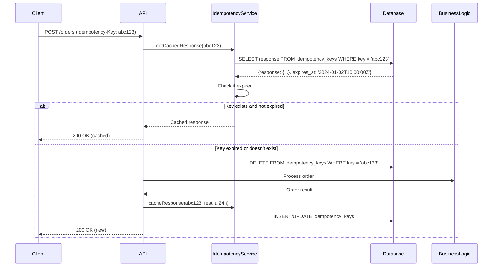
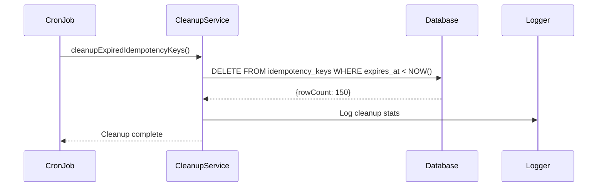

# Design Document: Database Idempotency Keys

## Overview

The FarmersMarketplace application currently has a database-backed idempotency system that stores keys in the `idempotency_keys` table. However, the system lacks automated TTL cleanup and may need optimization for multi-instance deployments. This design enhances the existing implementation with proper cleanup mechanisms, improved error handling, and performance optimizations.

## Architecture



## Sequence Diagrams

### Main Request Flow



### TTL Cleanup Flow



## Components and Interfaces

### IdempotencyService

**Purpose**: Manages idempotency key storage and retrieval with automatic expiration handling

**Interface**:
```javascript
interface IdempotencyService {
  getCachedResponse(key: string): Promise<any | null>
  cacheResponse(key: string, response: any, ttlHours?: number): Promise<void>
  cleanupExpiredKeys(): Promise<number>
}
```

**Responsibilities**:
- Retrieve cached responses for idempotency keys
- Store new responses with TTL
- Handle automatic cleanup of expired keys
- Provide database-agnostic interface for both PostgreSQL and SQLite

### CleanupJob

**Purpose**: Automated background job for removing expired idempotency keys

**Interface**:
```javascript
interface CleanupJob {
  startIdempotencyCleanup(): void
  cleanupExpiredIdempotencyKeys(): Promise<number>
}
```

**Responsibilities**:
- Schedule periodic cleanup of expired keys
- Log cleanup statistics
- Handle cleanup errors gracefully

## Data Models

### IdempotencyKey

```javascript
interface IdempotencyKey {
  key: string              // Primary key, unique identifier
  response: string         // JSON-serialized response data
  expires_at: DateTime     // Expiration timestamp
  created_at: DateTime     // Creation timestamp
}
```

**Validation Rules**:
- `key` must be non-empty string, max 255 characters
- `response` must be valid JSON string
- `expires_at` must be future timestamp
- `created_at` automatically set to current timestamp

### Database Schema

```sql
-- PostgreSQL version
CREATE TABLE idempotency_keys (
  key        TEXT PRIMARY KEY,
  response   TEXT NOT NULL,
  expires_at TIMESTAMP NOT NULL,
  created_at TIMESTAMP DEFAULT CURRENT_TIMESTAMP
);

CREATE INDEX idx_idempotency_expires_at ON idempotency_keys(expires_at);

-- SQLite version (existing)
CREATE TABLE idempotency_keys (
  key        TEXT PRIMARY KEY,
  response   TEXT NOT NULL,
  expires_at DATETIME NOT NULL,
  created_at DATETIME DEFAULT CURRENT_TIMESTAMP
);

CREATE INDEX idx_idempotency_expires_at ON idempotency_keys(expires_at);
```

## Algorithmic Pseudocode

### Main Idempotency Check Algorithm

```pascal
ALGORITHM getCachedResponse(key)
INPUT: key of type String
OUTPUT: response of type Object or null

PRECONDITIONS:
  - key is non-null and non-empty string
  - Database connection is available

POSTCONDITIONS:
  - Returns cached response if key exists and not expired
  - Returns null if key doesn't exist or is expired
  - Expired keys are automatically deleted

BEGIN
  IF key IS NULL OR key IS EMPTY THEN
    RETURN null
  END IF
  
  // Query database for key
  result ← database.query(
    "SELECT response, expires_at FROM idempotency_keys WHERE key = $1",
    [key]
  )
  
  IF result.rows.length = 0 THEN
    RETURN null
  END IF
  
  row ← result.rows[0]
  currentTime ← getCurrentTimestamp()
  
  // Check expiration
  IF row.expires_at > currentTime THEN
    TRY
      parsedResponse ← JSON.parse(row.response)
      RETURN parsedResponse
    CATCH parseError
      // Invalid JSON, delete corrupted entry
      database.query("DELETE FROM idempotency_keys WHERE key = $1", [key])
      RETURN null
    END TRY
  ELSE
    // Key expired, clean it up
    database.query("DELETE FROM idempotency_keys WHERE key = $1", [key])
    RETURN null
  END IF
END
```

### Cache Response Algorithm

```pascal
ALGORITHM cacheResponse(key, response, ttlHours)
INPUT: key of type String, response of type Object, ttlHours of type Number
OUTPUT: void

PRECONDITIONS:
  - key is non-null and non-empty string
  - response is serializable object
  - ttlHours is positive number (default: 24)
  - Database connection is available

POSTCONDITIONS:
  - Response is stored in database with expiration time
  - Existing key is updated if present

BEGIN
  IF key IS NULL OR key IS EMPTY THEN
    RETURN
  END IF
  
  IF ttlHours IS NULL OR ttlHours <= 0 THEN
    ttlHours ← 24
  END IF
  
  // Calculate expiration time
  expiresAt ← getCurrentTimestamp() + (ttlHours * 3600 * 1000)
  
  // Serialize response
  TRY
    serializedResponse ← JSON.stringify(response)
  CATCH serializationError
    LOG_ERROR("Failed to serialize response for key: " + key)
    RETURN
  END TRY
  
  // Upsert into database
  TRY
    database.query(
      "INSERT INTO idempotency_keys (key, response, expires_at) 
       VALUES ($1, $2, $3) 
       ON CONFLICT (key) DO UPDATE SET 
         response = EXCLUDED.response, 
         expires_at = EXCLUDED.expires_at",
      [key, serializedResponse, expiresAt]
    )
  CATCH databaseError
    LOG_ERROR("Failed to cache response for key: " + key + ", error: " + databaseError.message)
    // Don't throw - caching failure shouldn't break the request
  END TRY
END
```

### TTL Cleanup Algorithm

```pascal
ALGORITHM cleanupExpiredIdempotencyKeys()
INPUT: none
OUTPUT: deletedCount of type Number

PRECONDITIONS:
  - Database connection is available

POSTCONDITIONS:
  - All expired idempotency keys are removed from database
  - Returns count of deleted keys
  - Cleanup statistics are logged

BEGIN
  currentTime ← getCurrentTimestamp()
  
  // Database-specific query
  IF database.isPostgres THEN
    query ← "DELETE FROM idempotency_keys WHERE expires_at < NOW()"
  ELSE
    query ← "DELETE FROM idempotency_keys WHERE expires_at < datetime('now')"
  END IF
  
  TRY
    result ← database.query(query)
    deletedCount ← result.rowCount OR result.changes
    
    IF deletedCount > 0 THEN
      LOG_INFO("Cleaned up " + deletedCount + " expired idempotency keys")
    END IF
    
    RETURN deletedCount
  CATCH cleanupError
    LOG_ERROR("Failed to cleanup expired idempotency keys: " + cleanupError.message)
    RETURN 0
  END TRY
END
```

## Key Functions with Formal Specifications

### Function: getCachedResponse()

```javascript
async function getCachedResponse(key: string): Promise<any | null>
```

**Preconditions:**
- `key` is non-null, non-empty string with length ≤ 255 characters
- Database connection is established and functional

**Postconditions:**
- Returns parsed JSON object if key exists and not expired
- Returns `null` if key doesn't exist, is expired, or contains invalid JSON
- Expired or corrupted keys are automatically deleted from database
- No exceptions thrown for normal operation (database errors logged)

**Loop Invariants:** N/A (no loops in function)

### Function: cacheResponse()

```javascript
async function cacheResponse(key: string, response: any, ttlHours: number = 24): Promise<void>
```

**Preconditions:**
- `key` is non-null, non-empty string with length ≤ 255 characters
- `response` is JSON-serializable object
- `ttlHours` is positive number > 0 (defaults to 24)
- Database connection is established and functional

**Postconditions:**
- Response is stored in database with calculated expiration time
- Existing entries with same key are updated (upsert behavior)
- Function completes without throwing exceptions (errors logged only)
- Database state is consistent after operation

**Loop Invariants:** N/A (no loops in function)

### Function: cleanupExpiredKeys()

```javascript
async function cleanupExpiredKeys(): Promise<number>
```

**Preconditions:**
- Database connection is established and functional
- Current timestamp can be determined

**Postconditions:**
- All entries with `expires_at < current_time` are removed from database
- Returns exact count of deleted entries (≥ 0)
- Cleanup statistics are logged for monitoring
- Database integrity maintained after cleanup

**Loop Invariants:** N/A (single DELETE operation)

## Example Usage

### Basic Idempotency Flow

```javascript
// In route handler (e.g., POST /orders)
const idempotencyKey = req.headers['idempotency-key'];

if (idempotencyKey) {
  // Check for cached response
  const cached = await getCachedResponse(idempotencyKey);
  if (cached) {
    return res.status(cached.success ? 200 : 402).json(cached);
  }
}

// Process the request
try {
  const result = await processOrder(orderData);
  const responseData = { success: true, orderId: result.id, ...result };
  
  // Cache the response
  if (idempotencyKey) {
    await cacheResponse(idempotencyKey, responseData, 24);
  }
  
  return res.json(responseData);
} catch (error) {
  const errorData = { success: false, message: error.message };
  
  // Cache error responses too
  if (idempotencyKey) {
    await cacheResponse(idempotencyKey, errorData, 1); // Shorter TTL for errors
  }
  
  return res.status(500).json(errorData);
}
```

### TTL Cleanup Job Setup

```javascript
// In jobs/cleanupIdempotencyKeys.js
const cron = require('node-cron');
const { cleanupExpiredIdempotencyKeys } = require('../utils/idempotency');

function startIdempotencyCleanup() {
  // Run every 6 hours
  cron.schedule('0 */6 * * *', async () => {
    try {
      const deletedCount = await cleanupExpiredIdempotencyKeys();
      if (deletedCount > 0) {
        logger.info(`[idempotency-cleanup] Removed ${deletedCount} expired keys`);
      }
    } catch (error) {
      logger.error('[idempotency-cleanup] Job error:', { error: error.message });
    }
  });
  
  logger.info('[idempotency-cleanup] Cleanup job scheduled (every 6 hours)');
}

module.exports = { startIdempotencyCleanup };
```

### Multi-Instance Safe Usage

```javascript
// Safe for multiple application instances
const processPayment = async (paymentData, idempotencyKey) => {
  // Each instance checks the same database
  const cached = await getCachedResponse(idempotencyKey);
  if (cached) {
    return cached; // Consistent across all instances
  }
  
  // Only one instance will successfully process due to database constraints
  const result = await stellarService.submitPayment(paymentData);
  
  // All instances can safely cache (upsert behavior)
  await cacheResponse(idempotencyKey, result);
  
  return result;
};
```

## Correctness Properties

The idempotency system must satisfy these universal properties:

**Property 1: Idempotency Guarantee**
```
∀ key, request: 
  (getCachedResponse(key) ≠ null) ⟹ 
  (subsequent_requests_with_key_return_same_response)
```

**Property 2: Expiration Correctness**
```
∀ key, response, ttl:
  cacheResponse(key, response, ttl) ⟹
  (getCachedResponse(key) = response) ∨ (current_time > expires_at)
```

**Property 3: Cleanup Completeness**
```
∀ cleanup_execution:
  cleanupExpiredKeys() ⟹
  (∀ remaining_keys: remaining_keys.expires_at > current_time)
```

**Property 4: Multi-Instance Consistency**
```
∀ instance1, instance2, key:
  (instance1.getCachedResponse(key) = response) ⟹
  (instance2.getCachedResponse(key) = response ∨ null)
```

## Error Handling

### Error Scenario 1: Database Connection Failure

**Condition**: Database is unavailable during idempotency check
**Response**: Log error, return null (allow request to proceed without caching)
**Recovery**: Retry on next request, monitor database health

### Error Scenario 2: JSON Serialization/Parsing Error

**Condition**: Response cannot be serialized or cached response is corrupted
**Response**: Log error, delete corrupted entry, proceed without caching
**Recovery**: Fresh response will be generated and cached properly

### Error Scenario 3: TTL Cleanup Job Failure

**Condition**: Cleanup job encounters database error
**Response**: Log error with details, continue with next scheduled run
**Recovery**: Manual cleanup possible, monitor cleanup job health

### Error Scenario 4: Key Collision with Different Response

**Condition**: Same idempotency key used for different request data
**Response**: Return cached response (idempotency preserved)
**Recovery**: Client should use unique keys per unique request

## Testing Strategy

### Unit Testing Approach

Test individual functions with mocked database:
- `getCachedResponse()` with valid, expired, and non-existent keys
- `cacheResponse()` with various TTL values and response types
- `cleanupExpiredKeys()` with different expiration scenarios
- Error handling for database failures and invalid data

**Coverage Goals**: 95% line coverage, 100% branch coverage for error paths

### Property-Based Testing Approach

**Property Test Library**: fast-check (JavaScript)

**Key Properties to Test**:
1. **Idempotency Property**: Multiple calls with same key return same result
2. **Expiration Property**: Keys expire correctly based on TTL
3. **Cleanup Property**: Cleanup removes all and only expired keys
4. **Serialization Property**: Round-trip JSON serialization preserves data

**Example Property Test**:
```javascript
fc.assert(fc.property(
  fc.string({ minLength: 1, maxLength: 255 }), // key
  fc.object(), // response
  fc.integer({ min: 1, max: 168 }), // ttlHours
  async (key, response, ttlHours) => {
    await cacheResponse(key, response, ttlHours);
    const cached = await getCachedResponse(key);
    return JSON.stringify(cached) === JSON.stringify(response);
  }
));
```

### Integration Testing Approach

Test with real database (both PostgreSQL and SQLite):
- End-to-end request flow with idempotency headers
- Multi-instance simulation with concurrent requests
- TTL cleanup job execution and verification
- Database failover and recovery scenarios

## Performance Considerations

**Database Indexing**: Create index on `expires_at` column for efficient cleanup queries
**Connection Pooling**: Reuse existing database connection pool
**Cleanup Frequency**: Balance between storage usage and cleanup overhead (recommended: every 6 hours)
**Key Size Limits**: Enforce maximum key length (255 characters) to prevent abuse
**Response Size Limits**: Consider limiting cached response size to prevent memory issues

## Security Considerations

**Key Validation**: Sanitize idempotency keys to prevent injection attacks
**Response Sanitization**: Ensure cached responses don't contain sensitive data
**Access Control**: Idempotency keys are scoped per request, no cross-user access
**Audit Logging**: Log idempotency key usage for debugging and monitoring
**TTL Limits**: Enforce reasonable TTL limits to prevent indefinite storage

## Dependencies

**Existing Dependencies**:
- `node-cron`: For scheduling TTL cleanup jobs
- `better-sqlite3` or `pg`: Database drivers (already in use)
- Existing database schema and migration system

**New Dependencies**: None (enhancement of existing system)

**Database Requirements**:
- Index on `idempotency_keys.expires_at` for cleanup performance
- Sufficient storage for expected key volume and retention period