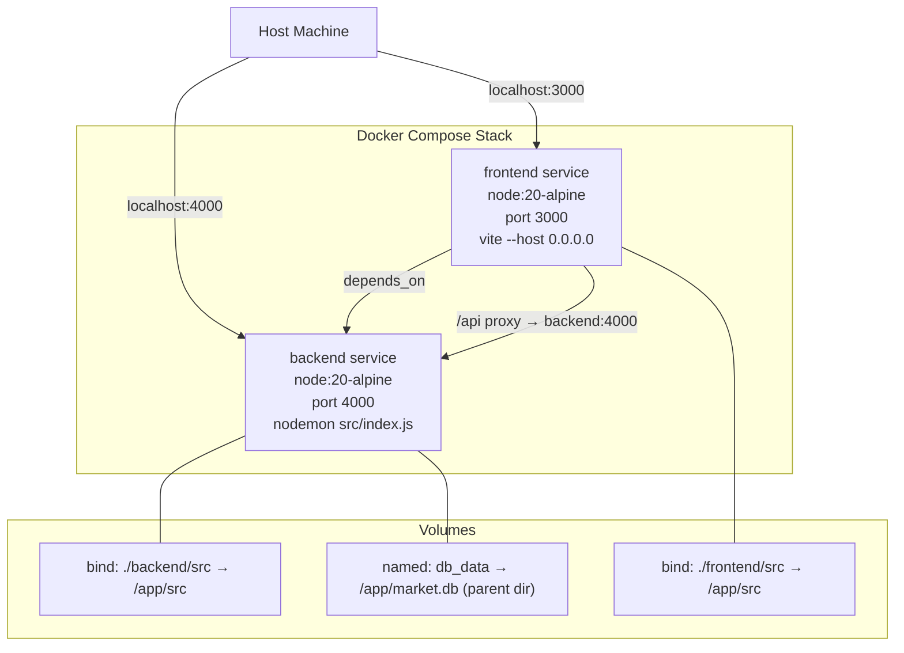

# Design Document: docker-compose-setup

## Overview

This design covers adding a Docker Compose development environment to FarmersMarketplace. The goal is a single `docker-compose up` command that starts both the Node.js/Express backend and the React/Vite frontend with hot reload, persists the SQLite database across restarts, and is documented in the README.

No application code changes are required — only new infrastructure files (`backend/Dockerfile`, `frontend/Dockerfile`, `docker-compose.yml`) and a README update.

## Architecture



The frontend Vite dev server proxies `/api` requests to the backend. Inside the Compose network, the frontend container reaches the backend via the service name `backend` on port 4000, so `VITE_API_URL=http://backend:4000` is set in the Compose file.

## Components and Interfaces

### backend/Dockerfile

- Base image: `node:20-alpine`
- Working directory: `/app`
- Copies `package*.json` and runs `npm install` (includes devDependencies for nodemon)
- Copies remaining source files
- Exposes port 4000
- CMD: `npm run dev`

The `./backend/src` bind mount overlays `/app/src` at runtime, so nodemon picks up host file changes without a rebuild.

### frontend/Dockerfile

- Base image: `node:20-alpine`
- Working directory: `/app`
- Copies `package*.json` and runs `npm install`
- Copies remaining source files
- Exposes port 3000
- CMD: `npm run dev` (Vite is configured to bind `0.0.0.0` via `--host` flag or `server.host` in vite.config.js)

The `./frontend/src` bind mount overlays `/app/src` at runtime for Vite HMR.

**Note on Vite host binding**: The existing `vite.config.js` sets `server.port: 3000` but does not set `server.host`. The Dockerfile CMD will use `vite --host` to bind `0.0.0.0`, making the dev server reachable from outside the container.

### docker-compose.yml

Top-level structure:

```
services:
  backend:
    build: ./backend
    ports: ["4000:4000"]
    env_file: ./backend/.env
    volumes:
      - ./backend/src:/app/src          # hot reload bind mount
      - db_data:/app                    # named volume for market.db directory
  frontend:
    build: ./frontend
    ports: ["3000:3000"]
    environment:
      - VITE_API_URL=http://backend:4000
    volumes:
      - ./frontend/src:/app/src         # hot reload bind mount
    depends_on:
      - backend

volumes:
  db_data:
```

**Volume strategy for market.db**: `better-sqlite3` writes `market.db` to `backend/src/db/../../market.db` = `backend/market.db`, which maps to `/app/market.db` inside the container. The named volume `db_data` is mounted at `/app` (the working directory). This means the entire `/app` directory is backed by the named volume, which persists `market.db` across restarts.

However, mounting a named volume at `/app` would shadow the image's installed `node_modules`. The correct approach is to mount the named volume at a dedicated subdirectory and move the DB file there, OR to keep the volume mount scoped to just the DB file's parent directory while ensuring `node_modules` is not shadowed.

**Chosen approach**: Mount `db_data` at `/app/data` and set the `DB_PATH` environment variable (or use a path override) so the backend writes `market.db` to `/app/data/market.db`. This keeps `node_modules` intact and isolates the persistent data.

Since `schema.js` uses `path.join(__dirname, '../../market.db')` (hardcoded), the simplest zero-code-change approach is to mount the named volume at `/app` and add an anonymous volume for `node_modules` to prevent it from being shadowed:

```yaml
volumes:
  - ./backend/src:/app/src
  - db_data:/app
  - /app/node_modules          # anonymous volume prevents named volume from shadowing node_modules
```

This is the standard Docker pattern for Node.js projects.

## Data Models

No new application data models are introduced. The only data concern is the SQLite database file location:

| File | Container path | Host persistence |
|------|---------------|-----------------|
| `market.db` | `/app/market.db` | Named volume `db_data` mounted at `/app` |
| Backend source | `/app/src/` | Bind mount `./backend/src` |
| Frontend source | `/app/src/` | Bind mount `./frontend/src` |
| Backend node_modules | `/app/node_modules` | Anonymous volume (prevents shadowing) |

### Environment Variables

The backend reads from `./backend/.env` (loaded via `env_file`). Key variables relevant to Docker:

| Variable | Default | Docker override needed? |
|----------|---------|------------------------|
| `PORT` | `4000` | No |
| `CLIENT_ORIGIN` | `http://localhost:3000` | No (host browser still uses localhost:3000) |
| `NODE_ENV` | `development` | No |

The frontend needs one Compose-level environment variable:

| Variable | Value | Purpose |
|----------|-------|---------|
| `VITE_API_URL` | `http://backend:4000` | Vite proxy target inside Docker network |


## Correctness Properties

*A property is a characteristic or behavior that should hold true across all valid executions of a system — essentially, a formal statement about what the system should do. Properties serve as the bridge between human-readable specifications and machine-verifiable correctness guarantees.*

This feature consists entirely of static configuration files (Dockerfiles, docker-compose.yml, README). There are no algorithms, data transformations, or logic that operate over a range of inputs. All acceptance criteria are therefore testable as concrete examples (assertions against file content) rather than universally quantified properties.

After prework analysis and property reflection, the testable criteria consolidate into four example-based correctness checks:

### Property 1: Backend Dockerfile is correctly configured

For the file `backend/Dockerfile`, it must declare `node:20-alpine` as the base image, run `npm install`, expose port 4000, and set CMD to `npm run dev`.

**Validates: Requirements 1.1, 1.2, 1.3, 1.4**

### Property 2: Frontend Dockerfile is correctly configured

For the file `frontend/Dockerfile`, it must declare `node:20-alpine` as the base image, run `npm install`, expose port 3000, set CMD to `npm run dev --host` (or equivalent), and bind to `0.0.0.0`.

**Validates: Requirements 2.1, 2.2, 2.3, 2.4, 2.5**

### Property 3: docker-compose.yml is correctly configured

For the file `docker-compose.yml`, it must define `backend` and `frontend` services, map ports 4000:4000 and 3000:3000, set `env_file: ./backend/.env` on the backend, declare bind mounts for `./backend/src` and `./frontend/src`, declare the `db_data` named volume mounted at `/app` on the backend (with an anonymous `/app/node_modules` volume), and set `depends_on: backend` on the frontend.

**Validates: Requirements 3.1, 3.3, 3.4, 3.5, 3.6, 3.7, 4.1, 4.2, 5.1**

### Property 4: README Docker Setup section is complete

For the file `README.md`, it must contain a "Docker Setup" section that references Docker installation, instructs copying `backend/.env.example` to `backend/.env`, documents `http://localhost:3000` and `http://localhost:4000`, and provides the `docker-compose up` command.

**Validates: Requirements 6.1, 6.2, 6.3, 6.4**

## Error Handling

Since this feature is infrastructure-only, error handling focuses on developer experience:

- **Missing .env file**: If `backend/.env` does not exist when `docker-compose up` runs, Docker Compose will fail with a clear error. The README instructs copying `.env.example` first to prevent this.
- **Port conflicts**: If ports 3000 or 4000 are already in use on the host, Docker will fail to bind. The README should note this as a common issue.
- **node_modules shadowing**: The anonymous volume `/app/node_modules` prevents the named volume `db_data` (mounted at `/app`) from shadowing the image-installed modules. Without this, the container would fail to start because `node_modules` would appear empty.
- **Vite host binding**: Without `--host`, Vite binds to `127.0.0.1` inside the container, making it unreachable from the host. The CMD must include `--host` or `vite.config.js` must set `server.host: true`.

## Testing Strategy

Since this feature produces only static configuration files, the testing strategy is example-based file content validation rather than property-based testing.

### Unit / Example Tests

Each correctness property maps to one example test that parses the relevant file and asserts its content:

| Test | File checked | Assertions |
|------|-------------|------------|
| Backend Dockerfile | `backend/Dockerfile` | FROM node:20-alpine, RUN npm install, EXPOSE 4000, CMD npm run dev |
| Frontend Dockerfile | `frontend/Dockerfile` | FROM node:20-alpine, RUN npm install, EXPOSE 3000, CMD includes --host |
| Compose file | `docker-compose.yml` | Services, ports, env_file, volumes, depends_on |
| README | `README.md` | Docker Setup section, URLs, .env copy instruction, Docker prerequisite |

These tests can be implemented as simple file-read + string/regex assertions in any test framework (e.g., Jest for consistency with the existing backend test suite).

**Tag format for traceability**: `Feature: docker-compose-setup, Property {N}: {property_text}`

### Property-Based Testing

No property-based tests are warranted for this feature. The acceptance criteria are all assertions about specific static values in configuration files, not rules that must hold across a range of generated inputs. A property-based testing library (e.g., fast-check) would add no value here.

### Manual Verification

The following must be verified manually after implementation:

1. `docker-compose up` starts both containers without errors
2. `http://localhost:3000` loads the React app in a browser
3. `http://localhost:4000/api/products` returns a JSON response
4. Editing a file in `backend/src/` triggers nodemon reload (visible in container logs)
5. Editing a file in `frontend/src/` triggers Vite HMR (visible in browser without full reload)
6. Stopping and restarting containers with `docker-compose down && docker-compose up` retains data in `market.db`
