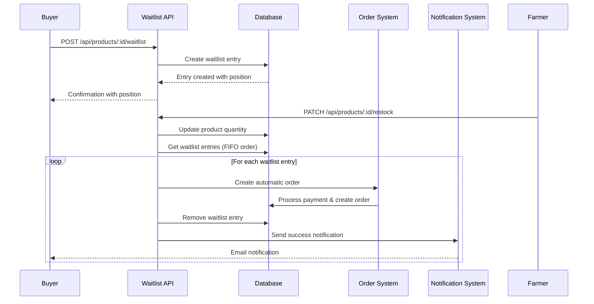

# Design Document: Product Waitlist

## Overview

The Product Waitlist feature enables buyers to join a queue for out-of-stock products and automatically processes their orders when stock is replenished. This system ensures fair access to high-demand products through a first-in-first-out (FIFO) ordering mechanism with automatic order placement and comprehensive buyer notifications.

The waitlist system integrates seamlessly with the existing marketplace infrastructure, leveraging current order processing, payment systems, and notification mechanisms while adding new database tables and API endpoints specifically for waitlist management.

## Architecture

### System Integration Points

The waitlist system integrates with several existing components:

- **Order Processing System**: Reuses existing order creation logic from `/api/orders` endpoint
- **Product Management**: Hooks into existing product restock functionality in `/api/products/:id/restock`
- **Notification System**: Extends current email notification system in `utils/mailer.js`
- **Authentication**: Uses existing JWT-based authentication middleware
- **Database Layer**: Utilizes current dual PostgreSQL/SQLite database abstraction

### High-Level Flow



## Components and Interfaces

### Database Schema

#### Waitlist Entries Table

```sql
CREATE TABLE waitlist_entries (
  id INTEGER PRIMARY KEY AUTOINCREMENT,
  buyer_id INTEGER NOT NULL,
  product_id INTEGER NOT NULL,
  quantity INTEGER NOT NULL,
  position INTEGER NOT NULL,
  created_at DATETIME DEFAULT CURRENT_TIMESTAMP,
  UNIQUE(buyer_id, product_id),
  FOREIGN KEY (buyer_id) REFERENCES users(id) ON DELETE CASCADE,
  FOREIGN KEY (product_id) REFERENCES products(id) ON DELETE CASCADE
);

CREATE INDEX idx_waitlist_product_position ON waitlist_entries(product_id, position);
CREATE INDEX idx_waitlist_buyer ON waitlist_entries(buyer_id);
```

### API Endpoints

#### POST /api/products/:id/waitlist
- **Purpose**: Join waitlist for out-of-stock product
- **Authentication**: Required (buyer only)
- **Request Body**: `{ "quantity": number }`
- **Response**: `{ "success": boolean, "position": number, "totalWaiting": number }`
- **Error Cases**: Already on waitlist, product in stock, invalid product

#### DELETE /api/products/:id/waitlist
- **Purpose**: Leave waitlist for product
- **Authentication**: Required (buyer only)
- **Response**: `{ "success": boolean, "message": string }`
- **Side Effect**: Updates positions for remaining entries

#### GET /api/products/:id/waitlist/status
- **Purpose**: Check waitlist status for product
- **Authentication**: Required (buyer only)
- **Response**: `{ "success": boolean, "onWaitlist": boolean, "position": number?, "totalWaiting": number }`

#### GET /api/waitlist/mine
- **Purpose**: Get buyer's active waitlist entries
- **Authentication**: Required (buyer only)
- **Response**: `{ "success": boolean, "data": WaitlistEntry[] }`

### Core Services

#### WaitlistService

```javascript
class WaitlistService {
  // Join waitlist for out-of-stock product
  async joinWaitlist(buyerId, productId, quantity)
  
  // Leave waitlist and update positions
  async leaveWaitlist(buyerId, productId)
  
  // Process waitlist when product is restocked
  async processWaitlistOnRestock(productId, availableQuantity)
  
  // Get waitlist position and total count
  async getWaitlistStatus(buyerId, productId)
  
  // Get all waitlist entries for a buyer
  async getBuyerWaitlistEntries(buyerId)
}
```

#### AutomaticOrderProcessor

```javascript
class AutomaticOrderProcessor {
  // Create order automatically for waitlist entry
  async createAutomaticOrder(waitlistEntry, product, buyer)
  
  // Handle payment processing for automatic orders
  async processPayment(order, buyer, farmer)
  
  // Send notifications for successful/failed orders
  async notifyOrderResult(order, buyer, product, success, error?)
}
```

## Data Models

### WaitlistEntry Model

```javascript
{
  id: number,
  buyer_id: number,
  product_id: number,
  quantity: number,
  position: number,
  created_at: string,
  // Populated via joins
  buyer_name?: string,
  buyer_email?: string,
  product_name?: string,
  product_price?: number
}
```

### Waitlist Status Response

```javascript
{
  success: boolean,
  onWaitlist: boolean,
  position?: number,
  totalWaiting: number,
  estimatedWaitTime?: string // Future enhancement
}
```

### Automatic Order Context

```javascript
{
  orderId: number,
  waitlistEntryId: number,
  isAutomaticOrder: true,
  processedAt: string,
  notificationSent: boolean
}
```
## Correctness Properties

*A property is a characteristic or behavior that should hold true across all valid executions of a system-essentially, a formal statement about what the system should do. Properties serve as the bridge between human-readable specifications and machine-verifiable correctness guarantees.*

### Property 1: Waitlist Entry Creation

*For any* buyer and out-of-stock product, when the buyer joins the waitlist with a valid quantity, the system should create a waitlist entry with all required fields (buyer_id, product_id, quantity, position, created_at) properly populated.

**Validates: Requirements 1.1**

### Property 2: Duplicate Prevention

*For any* buyer-product combination, attempting to join a waitlist when already on that waitlist should be rejected with an appropriate error message.

**Validates: Requirements 1.2**

### Property 3: In-Stock Product Rejection

*For any* product with positive stock quantity, attempting to join its waitlist should be rejected with an error indicating the product is available.

**Validates: Requirements 1.3**

### Property 4: FIFO Position Assignment

*For any* sequence of waitlist join operations, positions should be assigned in chronological order based on created_at timestamp, ensuring first-come-first-served ordering.

**Validates: Requirements 1.4, 2.1**

### Property 5: Position Recalculation on Removal

*For any* waitlist with multiple entries, removing an entry from any position should result in all subsequent entries having their positions decremented by one.

**Validates: Requirements 1.5, 4.3**

### Property 6: Automatic Order Creation Until Stock Exhaustion

*For any* restock event with limited quantity, the system should create automatic orders for waitlist entries in FIFO order until available stock is exhausted.

**Validates: Requirements 2.2**

### Property 7: Quantity Preservation

*For any* waitlist entry that gets processed into an automatic order, the order quantity should match the waitlist entry quantity exactly.

**Validates: Requirements 2.3**

### Property 8: Insufficient Stock Skipping

*For any* waitlist entry requiring more stock than available, the system should skip that entry and continue processing the next entry in line.

**Validates: Requirements 2.4**

### Property 9: Successful Order Cleanup

*For any* waitlist entry that successfully creates an automatic order, the corresponding waitlist entry should be removed from the database.

**Validates: Requirements 2.5**

### Property 10: Error Resilience

*For any* automatic order creation failure, the system should log the error and continue processing remaining waitlist entries without stopping.

**Validates: Requirements 2.6**

### Property 11: Order Notification Content

*For any* successful automatic order, the email notification should contain order details, product information, and total amount.

**Validates: Requirements 3.1, 3.3**

### Property 12: Insufficient Stock Notification

*For any* waitlist entry skipped due to insufficient stock, the buyer should receive a notification explaining why their order was not processed.

**Validates: Requirements 3.4**

### Property 13: Buyer Waitlist Visibility

*For any* buyer with active waitlist entries, querying their account should return all their waitlist entries with current positions.

**Validates: Requirements 4.1**

### Property 14: Product Waitlist Count Display

*For any* out-of-stock product with waitlist entries, the product page should display the correct total count of people waiting.

**Validates: Requirements 4.2, 4.4**

### Property 15: API Endpoint Behavior

*For any* valid authenticated buyer and product ID, the POST waitlist endpoint should create entries and the DELETE endpoint should remove entries, both returning appropriate HTTP status codes.

**Validates: Requirements 5.1, 5.2, 5.3, 5.4, 5.5**

### Property 16: Authorization Validation

*For any* waitlist deletion attempt, the system should verify the authenticated buyer owns the waitlist entry before allowing removal.

**Validates: Requirements 5.6**

### Property 17: Database Integrity Constraints

*For any* waitlist entry creation attempt, the system should enforce foreign key constraints and unique constraints, rejecting invalid or duplicate entries.

**Validates: Requirements 6.1, 6.2, 6.3, 6.4**

### Property 18: JSON Serialization Round Trip

*For any* valid waitlist entry object, serializing to JSON then parsing back should produce an equivalent object with all fields preserved.

**Validates: Requirements 7.1, 7.2, 7.3, 7.4**

### Property 19: Invalid Input Error Handling

*For any* malformed JSON input to waitlist endpoints, the system should return descriptive error messages with appropriate HTTP status codes.

**Validates: Requirements 7.5**

## Error Handling

### Input Validation Errors
- **Invalid Product ID**: Return 404 "Product not found"
- **Invalid Quantity**: Return 400 "Quantity must be a positive integer"
- **Malformed JSON**: Return 400 with descriptive parsing error message
- **Missing Authentication**: Return 401 "Authentication required"
- **Wrong User Role**: Return 403 "Only buyers can join waitlists"

### Business Logic Errors
- **Product In Stock**: Return 400 "Product is currently available for purchase"
- **Already On Waitlist**: Return 409 "Already on waitlist for this product"
- **Waitlist Entry Not Found**: Return 404 "Not on waitlist for this product"
- **Insufficient Balance**: Return 402 "Insufficient XLM balance for automatic order"

### System Errors
- **Database Connection**: Log error, return 500 "Internal server error"
- **Payment Processing**: Log error, continue processing other entries, notify buyer
- **Email Notification**: Log error, do not fail the operation
- **Concurrent Modification**: Use database transactions to prevent race conditions

### Error Recovery Strategies
- **Partial Processing Failures**: Continue processing remaining waitlist entries
- **Notification Failures**: Log errors but do not rollback successful orders
- **Database Deadlocks**: Implement retry logic with exponential backoff
- **Payment Failures**: Restore waitlist entry, notify buyer of failure reason

## Testing Strategy

### Dual Testing Approach

The waitlist system requires both unit testing and property-based testing for comprehensive coverage:

**Unit Tests** focus on:
- Specific API endpoint responses and error codes
- Database constraint violations and edge cases
- Integration points with existing order and notification systems
- Authentication and authorization scenarios
- Email notification content and formatting

**Property-Based Tests** focus on:
- Universal properties that hold across all valid inputs
- FIFO ordering behavior with randomized entry sequences
- Position recalculation correctness with various removal patterns
- Serialization round-trip properties with generated data
- Concurrent access scenarios with multiple buyers

### Property-Based Testing Configuration

- **Testing Library**: Use `fast-check` for JavaScript property-based testing
- **Test Iterations**: Minimum 100 iterations per property test
- **Test Tagging**: Each property test must reference its design document property

**Tag Format**: `Feature: product-waitlist, Property {number}: {property_text}`

Example property test structure:
```javascript
// Feature: product-waitlist, Property 4: FIFO Position Assignment
test('waitlist positions assigned in chronological order', () => {
  fc.assert(fc.property(
    fc.array(fc.record({
      buyerId: fc.integer(1, 1000),
      productId: fc.integer(1, 100),
      quantity: fc.integer(1, 10)
    }), 2, 20),
    (entries) => {
      // Test implementation
    }
  ), { numRuns: 100 });
});
```

### Integration Testing Requirements

- **Database Transactions**: Verify ACID properties during concurrent waitlist processing
- **Order System Integration**: Test automatic order creation with existing order validation
- **Email System Integration**: Verify notification content and delivery
- **Authentication Integration**: Test with existing JWT middleware
- **Stock Management Integration**: Test with existing product restock functionality

### Performance Testing Considerations

- **Concurrent Waitlist Processing**: Test system behavior with multiple simultaneous restock events
- **Large Waitlist Handling**: Verify performance with waitlists containing hundreds of entries
- **Database Query Optimization**: Ensure efficient queries for position calculations and FIFO processing
- **Memory Usage**: Monitor memory consumption during bulk waitlist processing operations